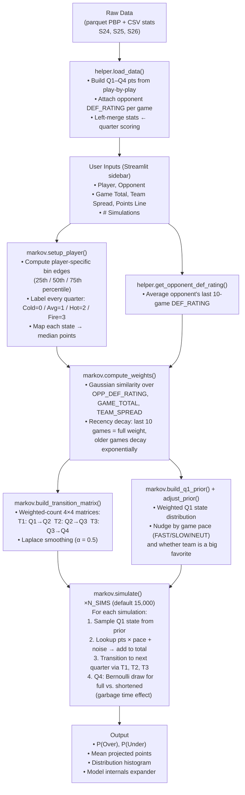

# HeatCheck — Workflow

## Overview

A Markov chain Monte Carlo (MCMC) simulator that estimates the probability a player scores over/under a betting line, using per-quarter scoring states and context-weighted historical games.

---

## Pipeline

---

## State System

Each quarter is labeled with one of four performance states based on the player's own historical percentiles:

| State | Label   | Meaning                      |
|-------|---------|------------------------------|
| 0     | Cold    | ≤ 25th percentile            |
| 1     | Average | 25th – 50th percentile       |
| 2     | Hot     | 50th – 75th percentile       |
| 3     | On-Fire | > 75th percentile            |

---

## Key Design Decisions

**Context-weighted games** — Historical games are not treated equally. Games played against similar opponents (by DEF_RATING), in similar pace environments (game total), and with similar spreads are weighted higher using a Gaussian kernel.

**Recency decay** — The 10 most recent games always get full weight. Games beyond that decay exponentially so the model stays current without ignoring older sample.

**Pace scaling** — Simulated quarter points are multiplied by `game_total / 230` so the model naturally projects more in fast-paced games.

**Shortened Q4** — There's a Bernoulli draw each sim for whether Q4 is played in full. The probability is derived from the team spread: big favorites are more likely to see garbage time (partial Q4 scoring).

**Laplace smoothing** — Transition matrices use α = 0.5 pseudo-count per cell to avoid zero-probability transitions from thin samples.

---

## File Map

| File        | Role                                                        |
|-------------|-------------------------------------------------------------|
| `app.py`    | Streamlit UI — inputs, result display, histogram            |
| `markov.py` | Core engine — state binning, weights, matrices, simulation  |
| `helper.py` | Data loading — PBP parsing, quarter scoring, DEF_RATING join|
| `data/`     | Season files: `s24_pbp.parquet`, `S24.csv`, etc.           |
